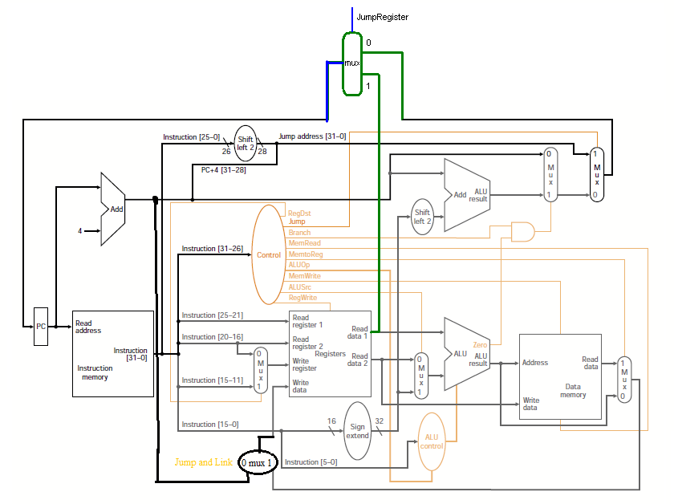

# Lab 3: CPU

### Franton Lin, Ian Paul, Byron Wagadugu

## Block Diagram 

We used a simple single cycle CPU design based on this image that we found. We modified the orginal to allow for jump and link. Because we our design is single cycled, we only have a clock cycle going into the instruction memory.

## Test Plan and Results

Most of this was integrating other verilog files. These already had tests which we included in our project. The parts that we wrote for this lab we tested by running assembly and looking at the memory at the end or the GTKWave. Our testing showed that all of our old, reused modules were still working. Mostly, our testing of the full CPU showed us where we had miswired modules together. The assembly testing was how we did most of our testing and final confirmations at the end.

## Performance/Area Analysis

vivado analysis goes here.

It's signle cycle so it's slow. We use instruction memory and data memory separately so it's big.

## Work Plan Reflections

We overestimated the total number of hours this would take by a small amount, but that's probably due to us including a decent number of steps that we didn't actually need. For example, when writing the work plan we thought we had to implement a lot more high level features and allocated them a few hours. Instead, we spent those hours debugging our CPU for the assembly tests. We were likely better at our timing estimate this time because we struggled far less with the FSM design. Last lab we needed to spend a few hours redoing scematics, but this time we stuck with out initial design.